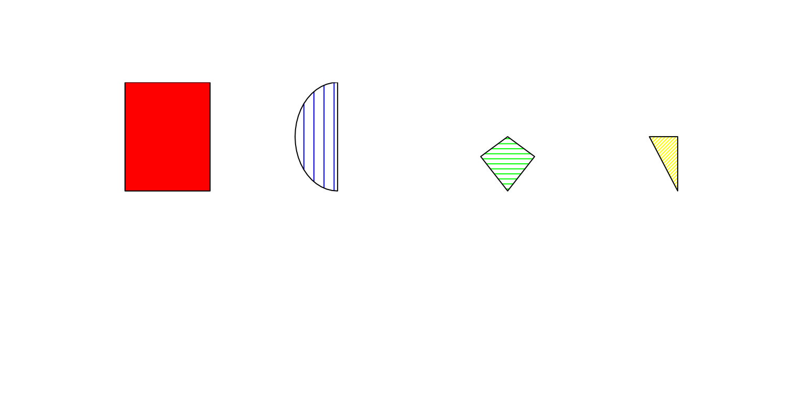

# Pedigree plotting details

## Introduction

The plotting function for Pedigrees has 5 tasks

1.  Gather information and check the data. An important step is the call
    to align.
2.  Set up the plot region and size the symbols. The program wants to
    plot circles and squares, so needs to understand the geometry of the
    paper, Pedigree size, and text size to get the right shape and size
    symbols.
3.  Set up the plot and add the symbols for each subject
4.  Add connecting lines between spouses, and children with parents
5.  Create an invisible return value containing the locations.

Another task, not yet completely understood, and certainly not
implemented, is how we might break a plot across multiple pages.

## Setup

The new version of the plotting Pedigree function works in two step.

- **[`ped_to_plotdf()`](https://louislenezet.github.io/Pedixplorer/reference/ped_to_plotdf.md)**
  create a dataframe from a Pedigree given containing all the necessary
  information to plot all the elements of the Pedigree: “polygons”,
  “text”, “segments”, “arcs”
- **`plot_from_df()`** use a given dataframe and plot all the element
  given

The advantage of this two step method, is that all the plotting can be
parralelised, each element can be customised by the user if necessary
and additional elements can also be added to the plot by just adding a
new row.

If multiple families are present in the Pedigree object, then one
dataframe per family will be produced and the first one will be plotted.

For more informations about those two functions, see the help page.

- [`help(ped_to_plotdf)`](https://louislenezet.github.io/Pedixplorer/reference/ped_to_plotdf.md)
- [`help(plot_fromdf)`](https://louislenezet.github.io/Pedixplorer/reference/plot_fromdf.md)

## Sizing

Now we need to set the sizes. From
[`align()`](https://louislenezet.github.io/Pedixplorer/reference/align.md)
we will get the maximum width and depth. There is one plotted row for
each row of the returned matrices. The number of columns of the matrices
is the max width of the Pedigree, so there are unused positions in
shorter rows, these can be identifed by having an nid value of 0.
Horizontal locations for each point go from 0 to xmax, subjects are at
least 1 unit apart; a large number will be exactly one unit part. These
locations will be at the top center of each plotted symbol.

### Set the graphical parameters

We would like to to make the boxes about 2.5 characters wide, which
matches most labels, but no more than 0.9 units wide or .5 units high.  
We also want to vertical room for the labels. This is done by the
[`set_plot_area()`](https://louislenezet.github.io/Pedixplorer/reference/set_plot_area.md)
function. We should have at least 1/2 of `stemp2` space above and
`stemp2` space below.  
The `stemp3` variable is the height of labels: users may use multi-line
ones. Our constraints then are

1.  \\(box height + label height) \times maxlev \le height\\ : the boxes
    and labels have to fit vertically
2.  \\(box height) \times (maxlev + \frac{(maxlev-1)}{2}) \le height\\ :
    at least 1/2 a box of space between each row of boxes
3.  \\(box width) \le stemp1\\ in inches
4.  \\(box width) \le 0.8\\ unit in user coordinates, otherwise they
    appear to touch
5.  User coordinates go from \\min(xrange)- \frac{box width}{2}\\ to
    \\max(xrange) + \frac{box width}{2}\\.
6.  the box is square (in inches)

The first 3 of these are easy. The fourth comes into play only for very
packed pedigrees. Assume that the box were the maximum size of .8 units,
i.e., minimal spacing between them. Then \\xmin -.45\\ to \\xmax + .45\\
covers the plot region, the scaling between user coordinates and inches
is \\(.8 + xmax-xmin)\\ and the box is \\.8 \times (figure width) /
(.8 + xmax-xmin)\\. The transformation from user units to inches
horizontally depends on the box size, since we need to allow for 1/2 a
box on the left and right.  
Vertically the range from 1 to nrow spans the tops of the symbols, which
will be the figure region height less (the height of the text for the
last row + 1 box); remember that the coordinates point to the top center
of the box. We want row 1 to plot at the top, which is done by
appropriate setting of the usr parameter.

### Subsetting and Sub-Region

This section is still experimental and might change. Also, in the
original documentation by TM Therneau, it is within the sizing section
above.

Sometimes a Pedigree is too large to fit comfortably on one page. The
`subregion` argument allows one to plot only a portion of the Pedigree
based on the plot region. Along with other tools to select portions of
the Pedigree based on relatedness, such as all the descendents of a
particular marriage, it gives a tool for addressing this. This breaks
our original goal of completely automatic plots, but users keep asking
for more.

The argument is `subregion = c(min x, max x, min depth, max depth)`, and
works by editing away portions of the `plist` object returned by align.
First decide what lines to keep. Then take subjects away from each line,
update spouses and twins, and fix up parentage for the line below.

## `ped_to_plotdf()`

This first function create the dataframe with the necessary plotting
information from a Pedigree object. The steps are:

1.  Add boxes (depend on affection and sex) and marks.
2.  Add deceased crossing if present.
3.  Add id text and labels
4.  Add in the connections, one by one, beginning with spouses.
5.  Add connections children to parents.
6.  Add lines/arcs to connect multiple instances of same subject.

### Details on the polygon filling and border

Each polygon is named based on its shape (“square”, “circle”,“diamond”,
“triangle”), the total number of division of the whole shape, and the
position of the division to plot.

``` r
library(Pedixplorer)
types <- c(
    "square_1_1", # Whole square
    "circle_2_1", # Semi circle first division
    "diamond_3_2", # Third of diamond second division
    "triangle_4_3" # Fourth of triangle third division
)
df <- plot_df <- data.frame(
    x0 = c(1, 3, 5, 7), y0 = 1,
    type = types,
    fill = c("red", "blue", "green", "yellow"),
    border = "black",
    angle = c(NA, 90, 0, 45),
    density = c(NA, 10, 20, 40)
)
plot_fromdf(df, usr = c(0, 8, 0, 2))
```



The number of division will depend on the number of affection register
in the `fill` slot of the `scale` slot of the Pedigree. The filling will
depend on the color given by the corresponding modality for each
individual, it is the same for the border of the polygon.

### Details on connecting children to parents.

First there are lines up from each child, which would be trivial except
for twins, triplets, etc. Then we draw the horizontal bar across
siblings and finally the connector from the parent. For twins, the
*vertical* lines are angled towards a common point, the variable is
called *target* below. The horizontal part is easier if we do things
family by family. The `plist$twins` variable is 1/2/3 for a twin on my
right, 0 otherwise.

### Details on arcs.

The last set of lines are dotted arcs that connect mulitiple instances
of a subject on the same line. These instances may or may not be on the
same line. The arrcconect function draws a quadratic arc between
locations \\(x1, y1)\\ and \\(x2, y2)\\ whose height is 1/2 unit above a
straight line connection.

## `plot_fromdf()`

### Polygons drawing

#### Symbols

There are three main symbols corresponding to the three sex codes:
square = male, circle = female, diamond= unknown. A triangle is use to
represent miscarriage. This triangle is crossed in the case of
Termination of Pregnancy (TOB) contrary to Spontaneous Abortion (SAB).  
They are shaded according to the value(s) of affected status for each
subject, and filling uses the standard arguments of the
[`polygon()`](https://rdrr.io/r/graphics/polygon.html) function. The
complexity is when multiple affected status are given, in which case the
symbol will be divided up into sections, clockwise starting at the lower
left. I asked Beth about this (original author) and there was no
particular reason to start at 6 o-clock, but it is now established as
history.

The first part of the code is to create the collection of polygons that
will make up the symbol. These are then used again and again. The
collection is kept as a list with the four elements square, circle,
diamond and triangle.

Each of these is in turn a list with `max(fill(ped, "order"))` elements,
and each of those in turn a list of x and y coordinates.

#### Circfun

The circle function is quite simple. The number of segments is
arbitrary, 50 seems to be enough to make the eye happy. We draw the ray
from 0 to the edge, then a portion of the arc. The polygon function will
connect back to the center.

#### Polyfun

Now for the interesting one — dividing a polygon into ‘’pie slices’’. In
computing this we can’t use the usual \\y= a + bx\\ formula for a line,
because it doesn’t work for vertical ones (like the sides of the
square). Instead we use the alternate formulation in terms of a dummy
variable \\z\\.

\\\begin{eqnarray\*} x &=& a + bz \\ y &=& c + dz \\ \end{eqnarray\*}\\

Furthermore, we choose the constants \\a\\, \\b\\, \\c\\, and \\d\\ so
that the side of our polygon correspond to \\0 \le z \le 1\\. The
intersection of a particular ray at angle theta with a particular side
will satisfy

\\\begin{eqnarray} theta &=& y/x = \frac{a + bz}{c+dz} \nonumber \\ z
&=& \frac{a\theta -c}{b - d\theta} \\ \end{eqnarray}\\

Equation \\z\\ will lead to a division by zero if the ray from the
origin does not intersect a side, e.g., a vertical divider will be
parallel to the sides of a square symbol. The only solutions we want
have \\0 \le z \le 1\\ and are in the ‘’forward’’’ part of the ray. This
latter is true if the inner product \\x \cos(\theta) + y \sin(\theta)
\>0\\. Exactly one of the polygon sides will satisfy both conditions.

## Final output and interactivness

The Pedigree is plotted in a new frame or added to the current device.
If `ggplot_gen = TRUE`, then a ggplot object is create with the same
informations and available in the invisible object given back by
`plot_fromdf()*`

This ggplot object can be used to further customise the plot, add
annotations, or make it interactive. The `tips` argument can be used to
add tooltips to the plot. They will be displayed when hovering over the
corresponding element through the `text` element.

``` r
data(sampleped)
pedi <- Pedigree(sampleped)

p <- plot(
    pedi, ggplot_gen = TRUE,
    tips = c("affection", "momid", "dadid"),
    symbolsize = 1.5, cex = 0.8
)
plotly::layout(
    plotly::ggplotly(p$ggplot, tooltip = "text"),
    hoverlabel = list(bgcolor = "darkgrey")
)
```

    Notes:
        Remind the user of subjects who did not get
        plotted; these are ususally subjects who are married in but without
        children. Unless the Pedigree contains spousal information the
        routine does not know who is the spouse.
        Then restore the plot parameters.
        This would only not be done if someone wants to further annotate
        the plot.

## Session information

``` r
sessionInfo()
```

    ## R version 4.4.3 (2025-02-28)
    ## Platform: x86_64-pc-linux-gnu
    ## Running under: Ubuntu 22.04.4 LTS
    ## 
    ## Matrix products: default
    ## BLAS:   /usr/lib/x86_64-linux-gnu/openblas-pthread/libblas.so.3 
    ## LAPACK: /usr/lib/x86_64-linux-gnu/openblas-pthread/libopenblasp-r0.3.20.so;  LAPACK version 3.10.0
    ## 
    ## locale:
    ##  [1] LC_CTYPE=en_US.UTF-8       LC_NUMERIC=C              
    ##  [3] LC_TIME=en_US.UTF-8        LC_COLLATE=en_US.UTF-8    
    ##  [5] LC_MONETARY=en_US.UTF-8    LC_MESSAGES=en_US.UTF-8   
    ##  [7] LC_PAPER=en_US.UTF-8       LC_NAME=C                 
    ##  [9] LC_ADDRESS=C               LC_TELEPHONE=C            
    ## [11] LC_MEASUREMENT=en_US.UTF-8 LC_IDENTIFICATION=C       
    ## 
    ## time zone: UTC
    ## tzcode source: system (glibc)
    ## 
    ## attached base packages:
    ## [1] stats     graphics  grDevices utils     datasets  methods   base     
    ## 
    ## other attached packages:
    ## [1] Pedixplorer_1.7.1 BiocStyle_2.32.1 
    ## 
    ## loaded via a namespace (and not attached):
    ##  [1] shinyjqui_0.4.1       gtable_0.3.6          xfun_0.57            
    ##  [4] bslib_0.10.0          ggplot2_4.0.2         shinyjs_2.1.1        
    ##  [7] htmlwidgets_1.6.4     lattice_0.22-9        quadprog_1.5-8       
    ## [10] vctrs_0.7.2           tools_4.4.3           generics_0.1.4       
    ## [13] stats4_4.4.3          tibble_3.3.1          pkgconfig_2.0.3      
    ## [16] Matrix_1.7-5          data.table_1.18.2.1   RColorBrewer_1.1-3   
    ## [19] S7_0.2.1              desc_1.4.3            S4Vectors_0.42.1     
    ## [22] readxl_1.4.5          lifecycle_1.0.5       stringr_1.6.0        
    ## [25] shinytoastr_2.2.0     compiler_4.4.3        farver_2.1.2         
    ## [28] textshaping_1.0.5     httpuv_1.6.17         shinyWidgets_0.9.1   
    ## [31] htmltools_0.5.9       sass_0.4.10           yaml_2.3.12          
    ## [34] lazyeval_0.2.2        plotly_4.12.0         later_1.4.8          
    ## [37] pillar_1.11.1         pkgdown_2.2.0         jquerylib_0.1.4      
    ## [40] tidyr_1.3.2           DT_0.34.0             cachem_1.1.0         
    ## [43] mime_0.13             tidyselect_1.2.1      digest_0.6.39        
    ## [46] stringi_1.8.7         colourpicker_1.3.0    dplyr_1.2.0          
    ## [49] purrr_1.2.1           bookdown_0.46         fastmap_1.2.0        
    ## [52] grid_4.4.3            cli_3.6.5             magrittr_2.0.4       
    ## [55] scales_1.4.0          promises_1.5.0        rmarkdown_2.31       
    ## [58] httr_1.4.8            igraph_2.2.2          otel_0.2.0           
    ## [61] cellranger_1.1.0      ragg_1.5.2            shiny_1.13.0         
    ## [64] evaluate_1.0.5        knitr_1.51            shinycssloaders_1.1.0
    ## [67] miniUI_0.1.2          viridisLite_0.4.3     rlang_1.1.7          
    ## [70] Rcpp_1.1.1            xtable_1.8-8          glue_1.8.0           
    ## [73] shinyhelper_0.3.2     BiocManager_1.30.27   BiocGenerics_0.50.0  
    ## [76] jsonlite_2.0.0        R6_2.6.1              plyr_1.8.9           
    ## [79] systemfonts_1.3.2     fs_2.0.1
